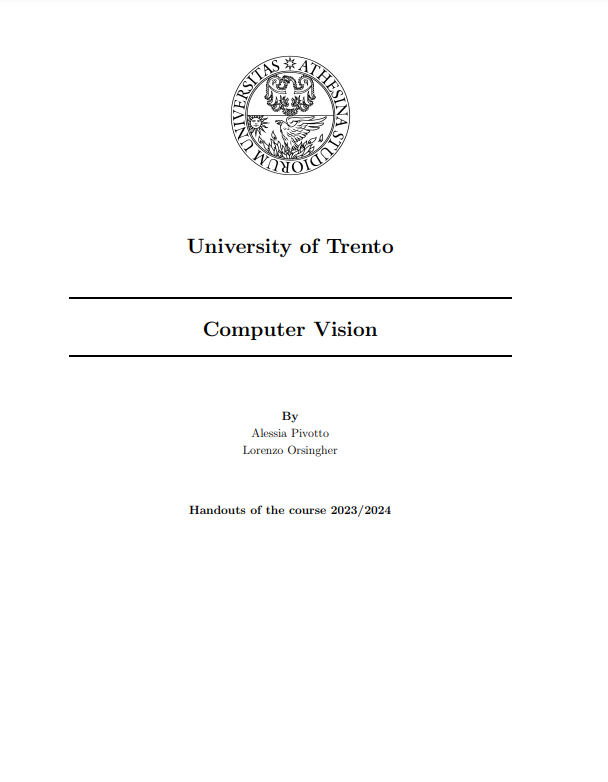

# 🤖Computer Vision👀

Hello world! Here you'll find e comprehensive recap of the Computer Vision course held by Prof. Conci at the University of Trento. The document covers pretty much all the topics discussed in class and it's a great source to prepare for the exam, the order of the topics is structured in a way that follows the course's progression.

|  |
| :--------------------------------------------------------------------------------------------------------------------------------------------------------------------------------------------------------------------------------------------------------: |
|                                                                                                                   Click to download                                                                                                                   |

Just be aware there might be some typos and errors in the document, feel free to contact us if you find any :)

## Topics Covered:
1. **Images and Videos** 
    -  Definitions 
    -  Color  
    - Edge extraction    
    - Filters
    -  Morphology 
2. **Models** 
    -  The Pinhole Camera Model
    - Projection 
    - Illumination Models  
    - Remarks on cameras and lenses 
3. **Motion Detection** 
    - Motion detection
    - Motion detection in practice 
4. **Motion Tracking**
    - Object Tracking   
    - 2D Tracking  
    - Blobs extraction   
    - Merging45
    - Occlusion
    - Tracking: Feature-based 
5. **Geometry**
    - Affine Transformations
    - Going 3D 
    - Calibration 
    - Calibration Procedure 
    - The Binocular Stereo 
    - Homography and friends 
6. **Local Feature Extraction**
    - HOG
    - SIFT 
7. **Classification** 
    - The classification process 
    - Regression 
    - The face detection problem 

## Contacts 

- [@lorenzoorsingher](https://github.com/lorenzoorsingher)
- [@AlessiaPivotto](https://github.com/AlessiaPivotto)
- [GitHub repo](https://github.com/lorenzoorsingher/CVBallTracking)